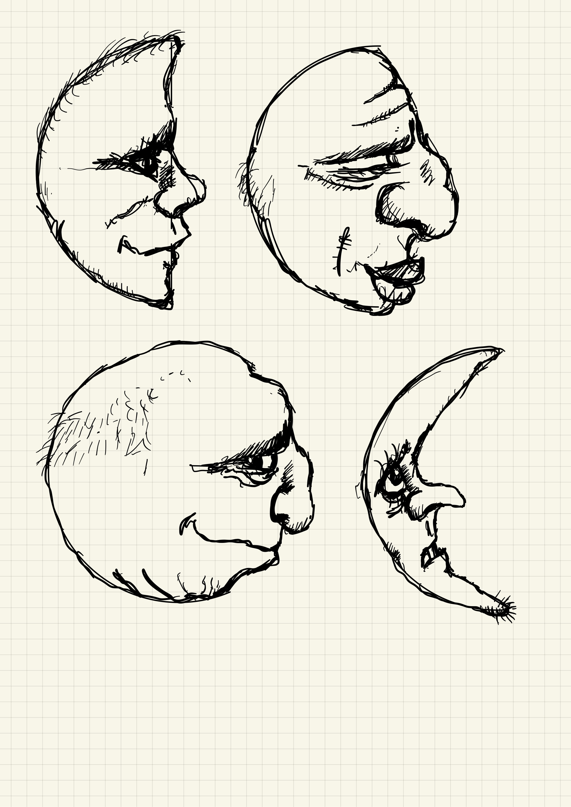
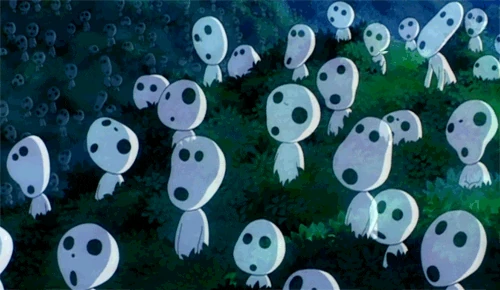
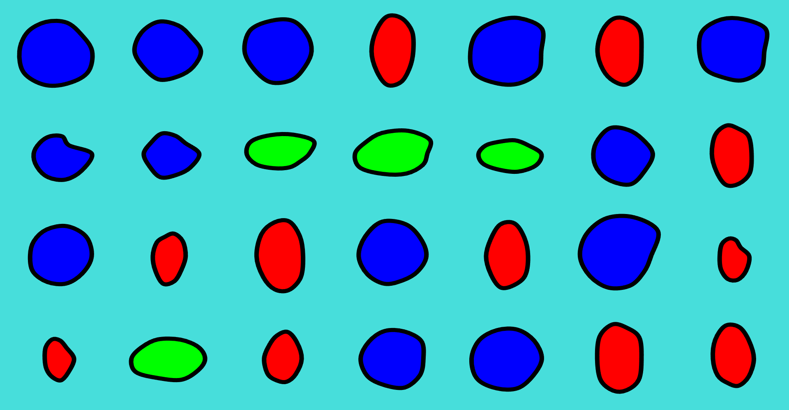
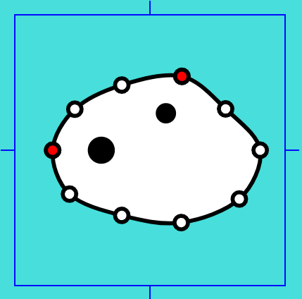
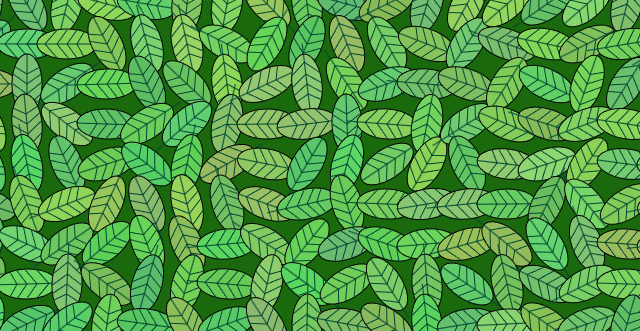
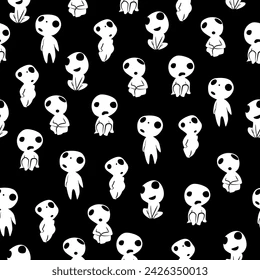

## 2024 MDDN342 Assignment 2: Randomised Collections

**This is where you talk about your project!**

When I first started I initially wanted to do something around the "faces" of the moon. 

Hoever I very quickly realised that that wasn't a very feasable idea, so I instantly thought about the movie "Princess Mononoke" by Hayao Miyazaki and more specifically the little kodamas.

The Kodamas are small spirits of the forest with an interesting design. They all look similar but are all unique in a way. That was the perfect thing for this parametrised assignment. 

My first task was to create a circular smooth shape. I went through a couple itterations on making this blob, and settled on placing 10 points around the center point, then add some randomness to the position of each point by a small margin. I then used curveVertex to connect them all. That gave me a randomised blob shape that was ideal for the Kodama faces.

I was then suggested to have a more drastic variation between some of the head because currently they were "circular" shape. (the Base shape was a circle). So I made that before creating the head. There is a random chance that the base shape will be chosen between three options. The normal circle, a horizontal oval, and a vertical circle. With that, it made it so that there was more variety between two Kodama but overall they still all looked similar. In the image below the three different base shape are shown by a different colour.

My next challenge was to implement the eyes. My problem was that even though the center of the head is centered around 0,0 because of the smooshing of the blob shape, sometimes the shape was a bit higher then usual or a bit more to the left or right etc... That meant that when I just added a circle for the eye at a fix point, sometimes, the eye would be hanging off the face. My solution was to seperate the 10 points used to creat the head into 3 groups. The top right group which will be used for the right eye, the top left group for the left eye, and the bottom group which was just an area I didnt want the eyes in.

Once those 10 points were seperated, I then select a random point from one of the groups. That is where the eye will be located, but I first need to center the eye a bit away from the edge before drawing it. 

Once that is done to both eyes, I now have two eyes that are always located withing the Kodama head, and the placement of the eye is randomised between four points each.

Next challenge was the mouth which I just based all the variables off of the eye located lowest on the face. That way when the eye is lower down the mouth will remain beneath the two eyes and still look somehwat face like. If the mouth ends up going past the chin, some logic just moves the mouth up a bit.

This is all the code for generating parameratrised heads. Some of the randomness is done internally (inside the head function), such as the the blobbiness of the head shape, the colour, transparentness and the randomness of the mouth. The rest (eye position, eye size, type of head shape, size) are done externally, so the randomess is defined in the arrangement.js .

For the arrangment of the faces on the canvas I wanted to try and creat a bit of a crow effect. So I itterate accross the canvas with some interval and call a noise function. I then use the noise function value, the crowdDensity and crowdScale values to determine weather a head will be generated at each itteration. This creates a sort of crowd effect with heads grouping up in some places and having empty space in some others.

For visual esthetics I created a body function that just draws a body for each head. There are no changes to the bodys between different characters. 

For the back ground I used a function that draws a leaf called Garden by thomm238. I then called the function accross the whole background with some randomised rotations and some colour variety to create a background that is visually pleasing while also refering to the original inspiration, the Kodama spirits. Which are forest spirits.

So all the previously is more an explanation of the coding I did and the steps I took. I'll now try and talk a bit on why I did some decisions.

So firstly I decided to kindof do this project without looking too closely at reference images. I had an idea of what they looked like in my head and I wanted to do those one. 
So the Kodamas from the reference have pretty "normal" head shapes, where the shape stays relatively "head-like". In my mind Those heads were like random blobs, which is why the ones in my project have some really wacky head shapes, while in the movie "Princess Mononoke" their head shapes reamin fairly tame.

Secondly the eye position, in the movie the eyes are again fairly un-irregular. So, that means that they have two eyes and a mouth in a fairly normal place on their faces. Some even have a small nose. I believed that their eyes could be a little more wacky, as in have them really high up on the face, one high one low, one to the left and one to the bottom right etc... This made for more obvious variety which I believe was in the spirit of the assignment which asked to creat a new set of faces everytime. In the image below is the Kodama from the movie:

And then some of the Kodamas my function generated:

For the Background I tried a few things that didn't work, including some random trees generating and noise particles wind thing. Both of these didn't really work and were a bit too complicated for something that is a background to the real project. So I found a function that draws a leaf by thomm238 and set out to try and created a leafy backdrop. In the movie the scene where we see them all together they are on top of trees, so it was quite fitting. I covered the background with those leafs making sure to add some randomness to the rotation of each one to create this tree top look.

For the colour, in the movie they are all white and I liked that esthetic so I did the same. However having them all as white kinda hurt my eyes and made it look a bit messy. So, I added a bit of randomness to the colour, allowing the white to range from full white to egg-shell white. It's a subtle change but I believe it to be a necessary one.

That same logic can be viewed with the leafy background I created. I didn't like that all the leafs were the same colour since it made the scene look very flat. So I added so colour variation. Now some of the leaves look a littled wilted or older bringing a little bit of realism. 

One last point is that these Kodamas are spirits of the forest. So having some of them be slightly transparent seemed right. The majority will be opaque since thats the way they are usually, but there is a small chance that they get generated while being slightly transparent as though they were appearing or disappearing like a spirit.